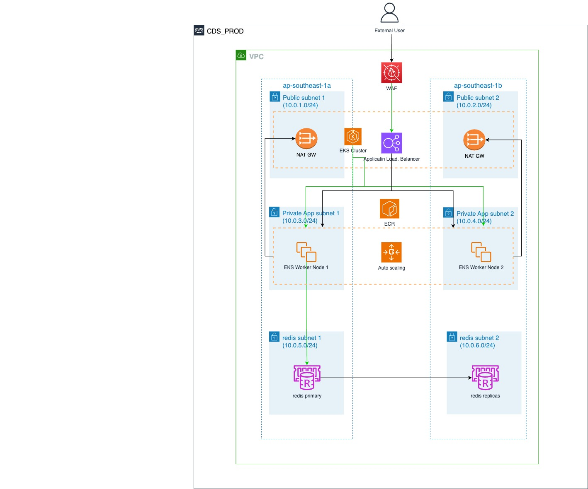

# GT-CDS

Proposed Architecture




## UAT
```
cd terraform/bootstrap
terraform workspace new uat
terraform init
terraform apply

cd terraform/iac
export ENV=uat
terraform workspace select uat
terraform init \
  -backend-config="bucket=cds-app-terraform-state" \
  -backend-config="key=iac/${ENV}/terraform.tfstate" \
  -backend-config="region=ap-southeast-1" \
  -backend-config="encrypt=true" \
  -backend-config="dynamodb_table=terraform-state"
terraform validate
terraform apply
```

## PRODUCTION
```
cd terraform/bootstrap
terraform workspace new prd
terraform init
terraform apply

cd terraform/iac
export ENV=prd
terraform workspace select prd
terraform init \
  -backend-config="bucket=cds-app-terraform-state" \
  -backend-config="key=iac/${ENV}/terraform.tfstate" \
  -backend-config="region=ap-southeast-1" \
  -backend-config="encrypt=true" \
  -backend-config="dynamodb_table=terraform-state"
terraform validate
terraform apply
```